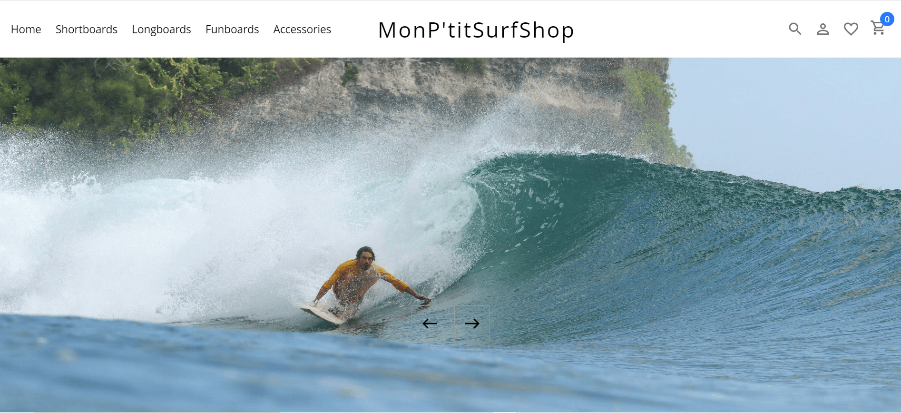

# MonPetitSurfShop

MonPetitSurfShop is an ecommerce shop where you can buy all type of surfboard.



## Main features

- Home page where you can find the category and featured product
- Category of either shortboard longboard funboard or accessories
- Product page with all detail of the product
- Cart where the user can see is shopping items and remove them if needed

## How to use the application?

### Step 1

The user choose a category of product

### Step 2

The user can filter product by sub category and price

### Step 3

Then user can add the article he desire to buy to his cart

## Technical aspects

The web site have a front-end coded with react that you can find in this repository: https://github.com/julienguyon12/clienSurfShop
The back-end is made with strapi and postgresql.

### Deployment

The application is deployed on render.

## Contributing

Pull requests are welcome. For major changes, please open an issue first to discuss what you would like to change.
Please make sure to update tests as appropriate.

## 🚀 Getting started with Strapi

Strapi comes with a full featured [Command Line Interface](https://docs.strapi.io/developer-docs/latest/developer-resources/cli/CLI.html) (CLI) which lets you scaffold and manage your project in seconds.

### `develop`

Start your Strapi application with autoReload enabled. [Learn more](https://docs.strapi.io/developer-docs/latest/developer-resources/cli/CLI.html#strapi-develop)

```
npm run develop
# or
yarn develop
```

### `start`

Start your Strapi application with autoReload disabled. [Learn more](https://docs.strapi.io/developer-docs/latest/developer-resources/cli/CLI.html#strapi-start)

```
npm run start
# or
yarn start
```

### `build`

Build your admin panel. [Learn more](https://docs.strapi.io/developer-docs/latest/developer-resources/cli/CLI.html#strapi-build)

```
npm run build
# or
yarn build
```

## ⚙️ Deployment

Strapi gives you many possible deployment options for your project. Find the one that suits you on the [deployment section of the documentation](https://docs.strapi.io/developer-docs/latest/setup-deployment-guides/deployment.html).
